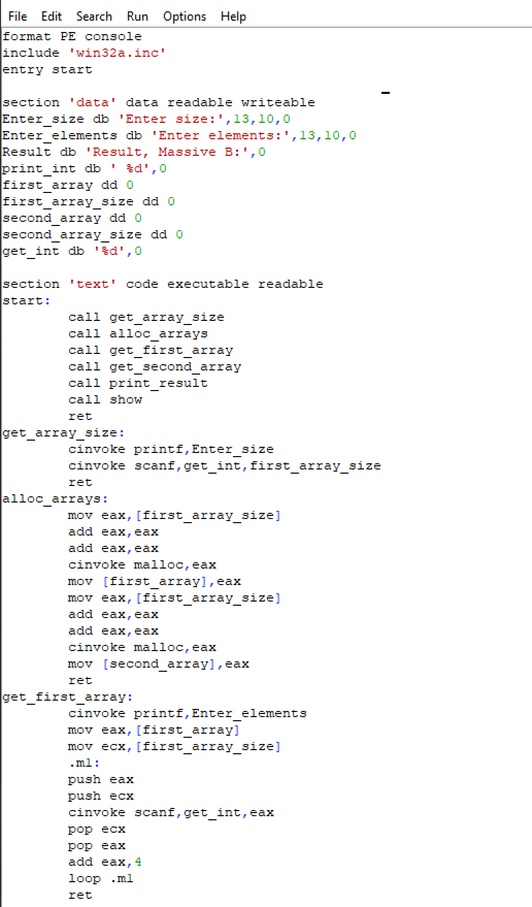
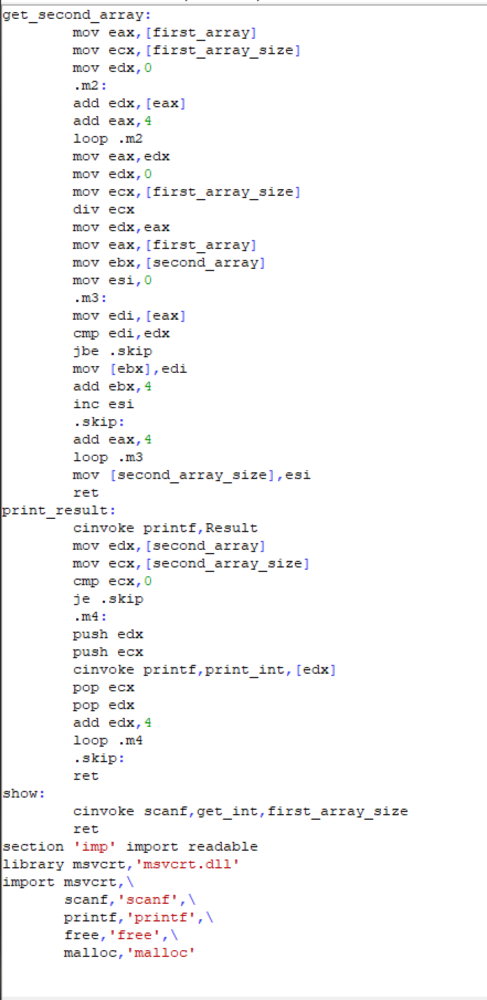
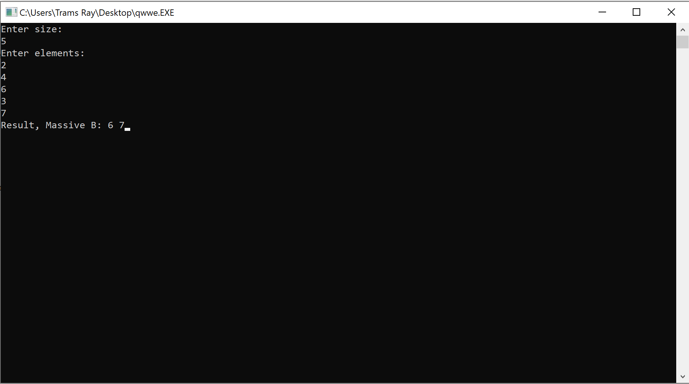
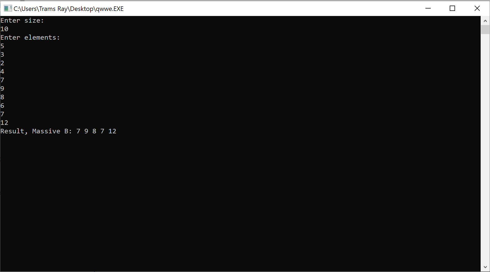

#Программа для ввода массива А и генерации массива B, элементы, которого больше среднего арифметического элементов массива А
##Выполнил Поволоцкий Виктор Александрович, студент БПИ199 <vapovolotskiy@edu.hse.ru>
###Описание работы программы:
1. Пользователь вводит N размер массива А с клавиатуры.
2. Затем программа просит ввести пользователя N элементов массива
3. Затем программа вычисляет среднее арифмитическое всех элементов массива 
и генерирует массив B из тех элементов, которые больше среднего арифмитического 
4. Выводит массив B в консоль
###Примеры работы кода: 
####Скриншот 1. Текст программы(1) 

####Скриншот 2. Текст программы(2)

###Краткое описание методов, указанных выше:
* __get_array_size__ - получает размер массива А 
* __alloc_arrays__ - разервированние массивов 
* __get_first_array__ - ввод элементов в первый массив А
* __get_second_array__ - подсчет среднего арифметического 
и запись нужных элементов в массив В
* __print_result__ - вывод результата (массив B)
####Скриншот 1. Тест при 5 введенных элементах 

####Скриншот 2. Тест при 10 введенных элементах

## [Контакты.](https://vk.com/vpovolotsky)
 
 